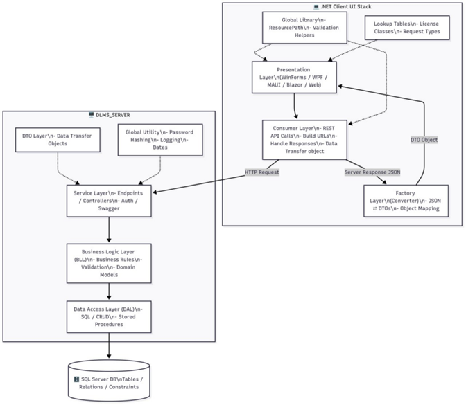

Abstract – DLMS Server (Backend)
The DLMS Server is the backend service layer of the Driver License Management System, designed to handle all core operations related to license management in a secure, scalable, and modular fashion. This repository implements the server-side logic, database access, and service orchestration that power the DLMS desktop and future web/mobile clients.
🏗️ Architecture Overview
The server is structured into three primary layers and two supporting layers:
1. Data Access Layer (DAL)
- Encapsulates all interactions with SQL Server and stored procedures.
- Handles CRUD operations: insert, update, delete, and query.
- Isolates database logic from the rest of the system.
2. Business Logic Layer (BLL)
- Contains business models and domain logic.
- Validates data before passing it to DAL.
- Implements rules for license issuance, renewal, re-testing, and more.
3. Service Layer (DLMS_SERVER)
- Exposes RESTful APIs via controllers.
- Handles authentication and request validation.
- Coordinates between BLL and client-facing layers.
🧩 Supporting Layers
• DTO Layer
- Facilitates lightweight data transfer between server and clients.
- Ensures clean separation between internal models and external contracts.
• GlobalUtility Layer
- Provides helper functions:
- Password hashing
- Age and date calculations
- Logging via NLog
Key Features
- Modular n-tier architecture for maintainability and scalability
- Role-based access and authentication
- Clean separation of concerns across layers
- Ready for integration with multiple client types (WinForms, WPF, MAUI, Blazor, JS frameworks) 

📦 Deployment Notes
- Built on .NET 8 Asp.net web api 
- SQL Server as the relational database
- Can be hosted as a Windows service, IIS app, or containerized for cloud deployment 

## 🧭 System Architecture

The DLMS Server follows a layered architecture that separates concerns across data access, business logic, and service orchestration. Below is a visual representation of the system:

